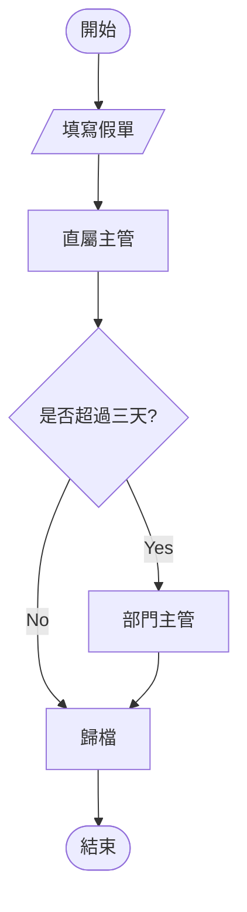

```mermaid
flowchart TD
    Start([開始]) --> FillOutTheForm@{shape: lean-r, label: "填寫假單"}
    FillOutTheForm --> DirectSupervisor[直屬主管]
    DirectSupervisor --> IsItMoreThanThreeDays{是否超過三天?}
    IsItMoreThanThreeDays --> |Yes| DepartmentSupervisor[部門主管]
    IsItMoreThanThreeDays --> |No| Archive
    DepartmentSupervisor --> Archive[歸檔]
    Archive --> End([結束])
```

