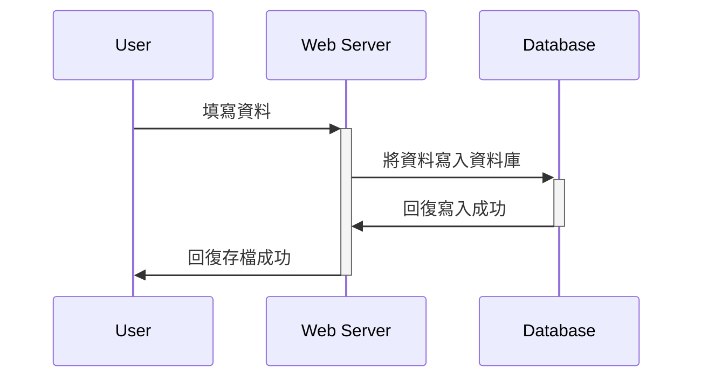

# 流程圖

```mermaid
flowchart TD
    Start([開始]) --> FillOutTheForm@{shape: lean-r, label: "填寫假單"}
    FillOutTheForm --> DirectSupervisor[直屬主管]
    DirectSupervisor --> IsItMoreThanThreeDays{是否超過三天?}
    IsItMoreThanThreeDays --> |Yes| DepartmentSupervisor[部門主管]
    IsItMoreThanThreeDays --> |No| Archive
    DepartmentSupervisor --> Archive[歸檔]
    Archive --> End([結束])
```

# 循序圖

```mermaid
sequenceDiagram
    participant user as User
    participant web as Web Server
    participant db as Database
    user->>+web: 填寫資料
    web->>+db: 將資料寫入資料庫
    db->>-web: 回復寫入成功
    web->>-user: 回復存檔成功
```
